# 📱 Pokédex App (React Native)

Aplicación móvil de Pokédex construida con **React Native (0.87.1)** y **React 19**, implementando **Clean Architecture**, soporte sin conexión (offline-first) con persistencia en **MMKV**, gestión de estado asíncrono y caché con **TanStack Query** e interfaz moderna con **React Native Paper (Material Design 3)**.

---

## 📸 Capturas de Pantalla (Screenshots)

### 📱 Vistas Principales (iOS vs Android Móvil)

| Pantalla | iOS | Android |
| :--- | :---: | :---: |
| **Lista Principal (`HomeScreen`)** | 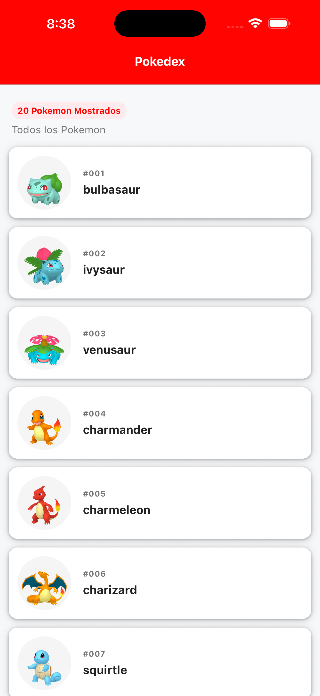 | 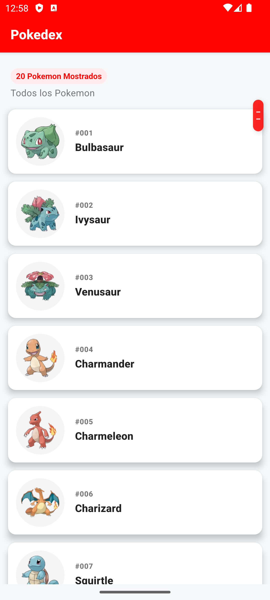 |
| **Detalle del Pokémon (`DetailScreen`)** | 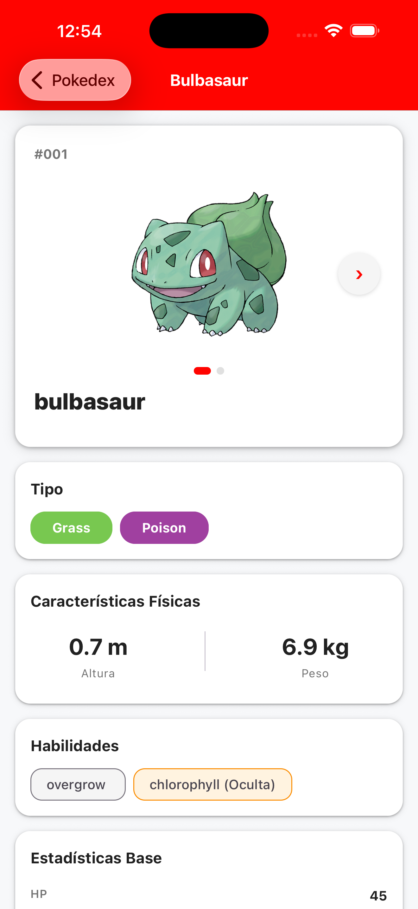 | 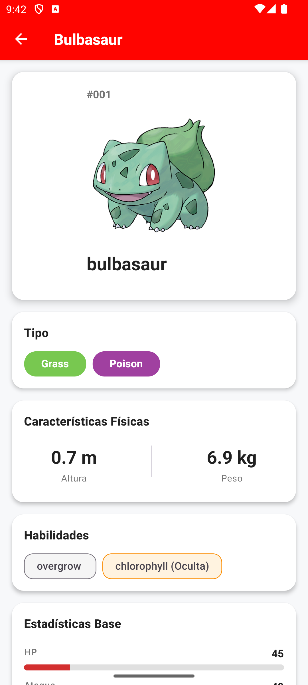 |

### 📟 Adaptabilidad en Tablet

| Lista Principal (`HomeScreen Tablet`) | Detalle del Pokémon (`DetailScreen Tablet`) |
| :---: | :---: |
| 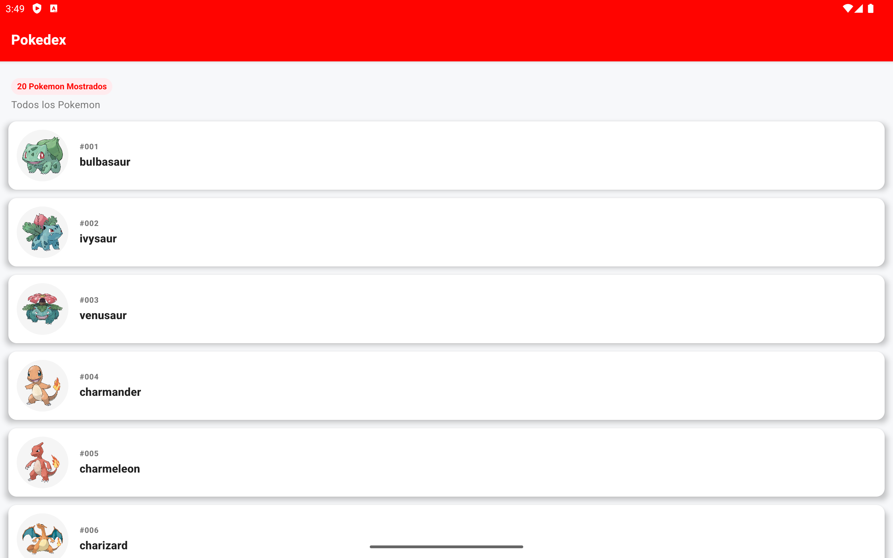 | 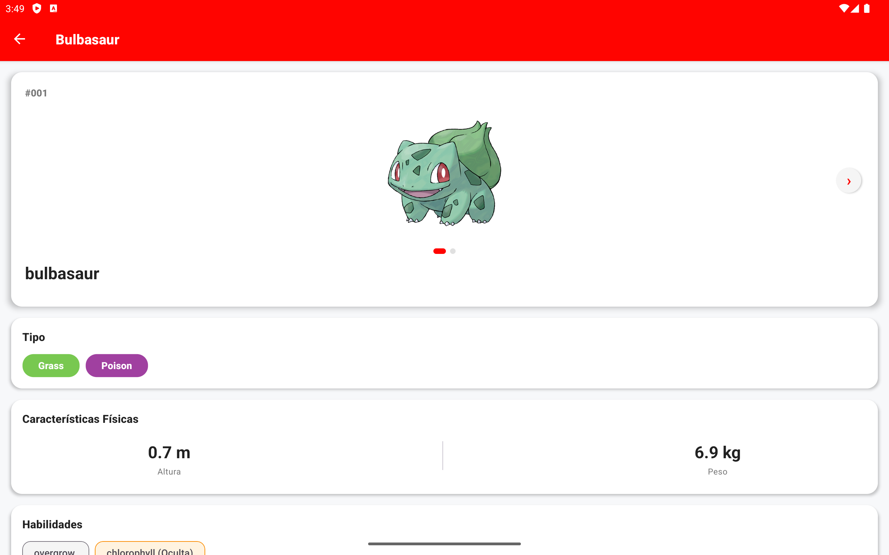 |


### 🛠️ Manejo de Estados de la UI (Feedback al Usuario)

| Estado de Carga (`Skeleton`) | Modo Sin Conexión (`Offline`) |
| :---: | :---: |
| 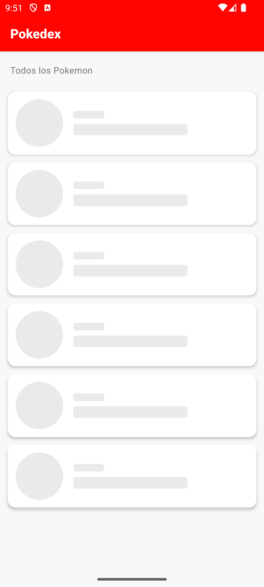 | 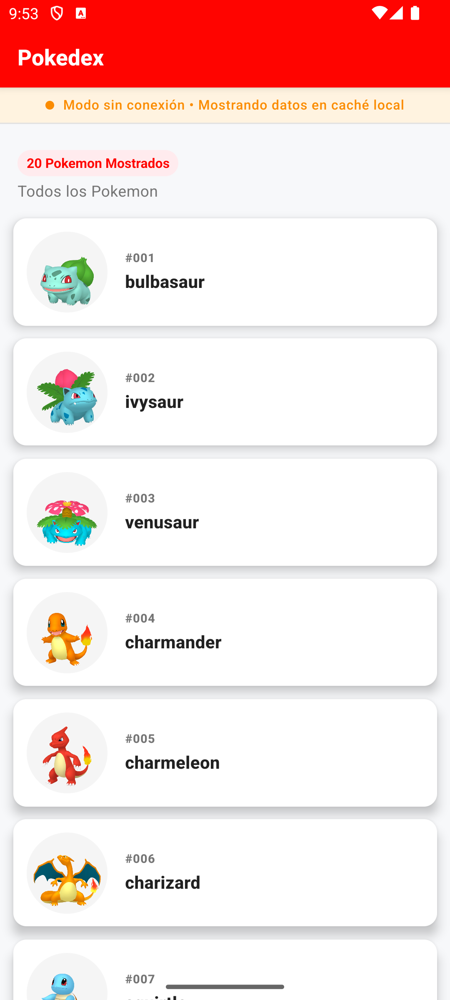 |

| Estado de Error (`ErrorState`) | Estado Vacío (`EmptyState`) |
| :---: | :---: |
| 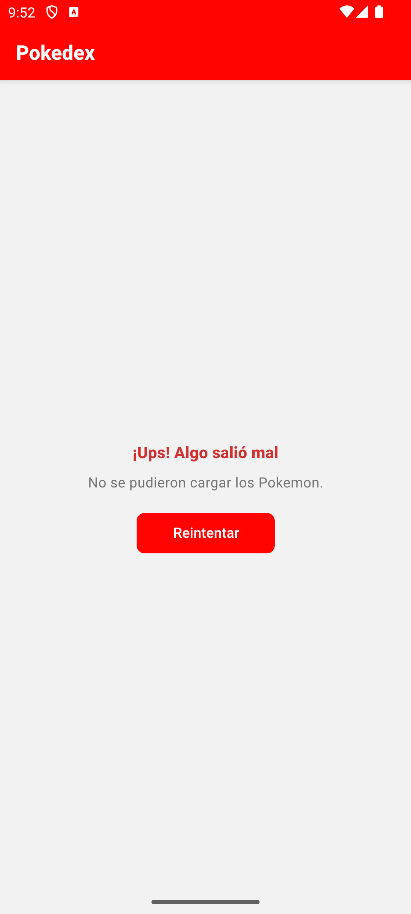 | 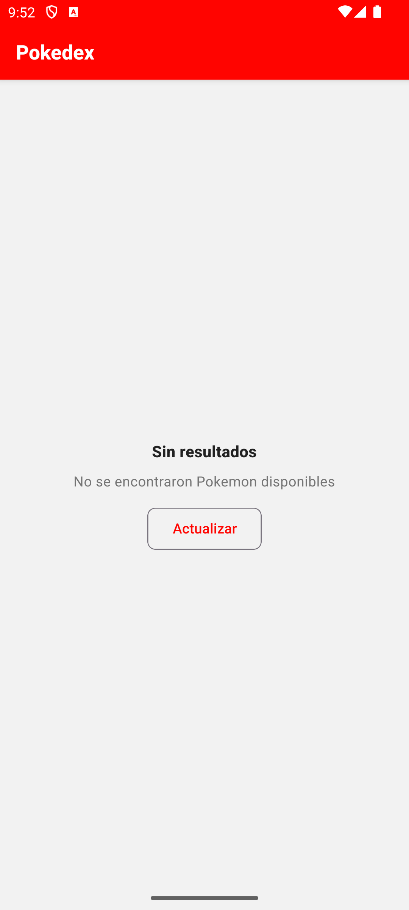 |

### 🔍 Evidencias de Depuración y Rendimiento (DevTools & Profiler)

| Árbol de Navegación (`React Navigation`) | Inspección de Caché y Persistencia (`MMKV Storage`) |
| :---: | :---: |
| 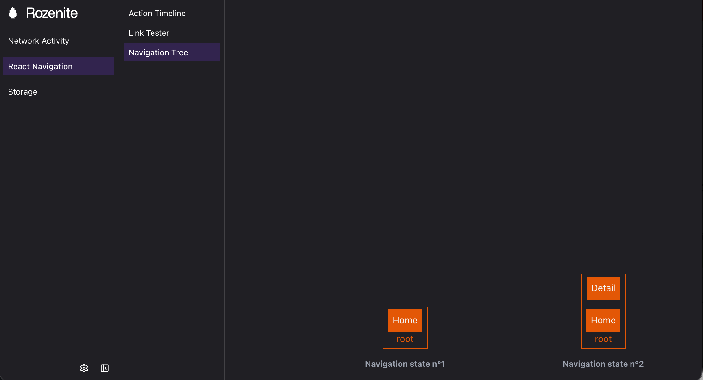 | <video src="./img-doc/storageMmkv.mp4" width="380" controls></video><br/>[▶️ Ver video de persistencia (`storageMmkv.mp4`)](./img-doc/storageMmkv.mp4) |

| Perfilado de Rendimiento y Prevención de Re-renderizados (`React DevTools Profiler`) |
| :---: |
| <video src="./img-doc/profile-detail.mp4" width="600" controls></video><br/>[▶️ Ver video de perfilado en DetailScreen (`profile-detail.mp4`)](./img-doc/profile-detail.mp4)<br/>*Demostración mediante el Flamegraph del Profiler: al cambiar entre las imágenes del carrusel en `DetailScreen`, gracias a la técnica de **State Colocation** y modularización (`PokemonImageSlider`), los componentes inferiores (Tipos, Características Físicas, Habilidades y Estadísticas Base) no se re-renderizan («Did not render»), eliminando renders innecesarios y optimizando el rendimiento.* |

| Inspección y Auditoría de Accesibilidad en iOS (`Xcode Accessibility Inspector` & `VoiceOver`) |
| :---: |
| <video src="./img-doc/accessibility.mov" width="600" controls></video><br/>[▶️ Ver video de accesibilidad (`accessibility.mov`)](./img-doc/accessibility.mov)<br/>*Validación en vivo con **Accessibility Inspector** de Xcode: inspección de elementos accesibles en el simulador de iOS, confirmando el mapeo de **Basic** (`Label`, `Type`, `Identifier`) y **Advanced** (`Help`) para una navegación asistiva fluida con VoiceOver.* |

---

## 🚀 Guía de Inicio Rápido

### 🤖 Pasos para Android

1. **Instalar dependencias con npm**:
   Desde la ruta raíz del proyecto:
   ```bash
   npm install
   ```

2. **Iniciar Metro Bundler en la ruta raíz**:
   ```bash
   npm run start
   ```
   > 💡 **Nota**: Metro iniciará con la suite **Rozenite** habilitada para depurar almacenamiento MMKV, red y navegación.

3. **Compilar y ejecutar en Android**:
   En una **segunda terminal** (en la ruta raíz):
   ```bash
   npm run android
   ```

---

### 🍏 Pasos para iOS

1. **Instalar dependencias con npm**:
   Desde la ruta raíz del proyecto:
   ```bash
   npm install
   ```

2. **Instalar dependencias nativas (CocoaPods)**:
   ```bash
   cd ios && pod install && cd ..
   ```
   *(O mediante Bundler: `bundle install && bundle exec pod install`)*

3. **Iniciar Metro Bundler en la ruta raíz**:
   ```bash
   npm run start
   ```

4. **Compilar y ejecutar en iOS**:
   En una **segunda terminal** (en la ruta raíz):
   ```bash
   npm run ios
   ```

---

### 🧪 Ejecución de Pruebas (Testing)

#### Pruebas Unitarias y de Integración (Jest)
Para ejecutar la suite completa de pruebas unitarias y de integración con **Jest** y **React Native Testing Library**:

```bash
npm run test
```

##### 🎥 Evidencia de Ejecución de Pruebas con Jest

<video src="./img-doc/jest.mp4" width="600" controls></video><br/>
[▶️ Ver video de pruebas con Jest (`jest.mp4`)](./img-doc/jest.mp4)

#### Pruebas End-to-End E2E (Maestro)
Para ejecutar las pruebas automáticas de extremo a extremo con el emulador o dispositivo conectado (se requiere tener instalado Maestro en el sistema y el emulador/dispositivo en ejecución):

```bash
# Ejecutar flujo E2E con Maestro
npm run test:e2e
# o directamente con el CLI
maestro test maestro/pokedex_flow.yaml
```

##### 🎥 Evidencia de Ejecución E2E con Maestro

<video src="./img-doc/maestro.mp4" width="600" controls></video><br/>
[▶️ Ver video de ejecución de pruebas Maestro (`maestro.mp4`)](./img-doc/maestro.mp4)

#### 🛡️ Análisis de Seguridad y Vulnerabilidades (Trivy)
Para realizar un análisis del sistema de archivos en busca de vulnerabilidades con severidad `HIGH` y `CRITICAL` excluyendo carpetas de artefactos de compilación:

```bash
npm run security:trivy
```

#### 📊 Gráfico de Dependencias de la Arquitectura (dependency-cruiser)
Genera un diagrama visual en formato SVG (`dependency-graph.svg`) para analizar y auditar las dependencias e importaciones de la aplicación a partir de `App.tsx`:

> 💡 **Requisitos previos**:
> - Requiere tener instalado **Graphviz** en el sistema para utilizar el comando `dot` (en macOS: `brew install graphviz`, en Linux/Ubuntu: `sudo apt install graphviz`).
> - Utiliza `npx` bajo demanda, por lo que **no** requiere instalar paquetes globales de Node.js.

```bash
# Generar el diagrama SVG con npm
npm run dependency-cruiser

# O directamente mediante npx:
npx depcruise --no-config --ts-config ./tsconfig.json --max-depth 8 --exclude 'node_modules|react-native' --output-type dot App.tsx | dot -T svg > dependency-graph.svg
```

##### 🗺️ Diagrama de Dependencias Generado

<p align="center">
  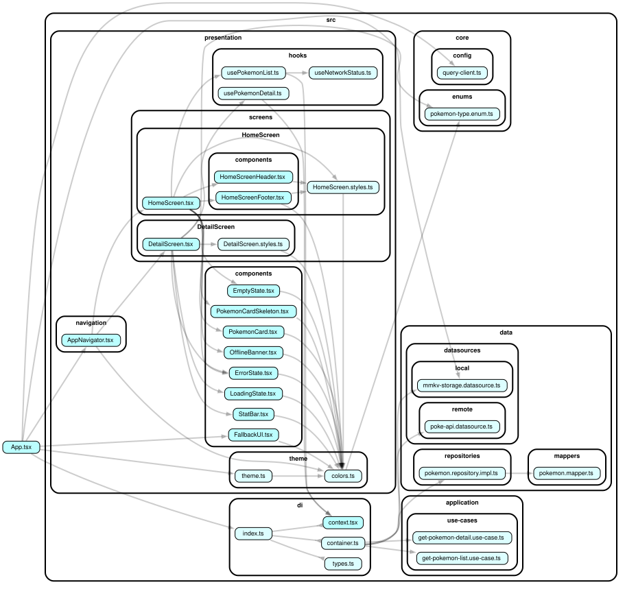
</p>

[▶️ Ver o descargar archivo vectorial completo (`dependency-graph.svg`)](./dependency-graph.svg)

---

### 🔄 Integración Continua (GitHub Actions)

El proyecto cuenta con un workflow automatizado en [`.github/workflows/ci.yml`](./.github/workflows/ci.yml) que se ejecuta en cada `push` o `pull_request` a la rama `main`:

1. **Instalación limpia y reproducible** con `npm ci` y caché de dependencias.
2. **Análisis de código estático (Linter)** con `npm run lint` (ESLint).
3. **Comprobación de tipos (Type Checking)** con `npm run typecheck` (TypeScript sin emisión de archivos).
4. **Ejecución de Pruebas Automatizadas** con `npm test -- --ci --maxWorkers=2` (Jest).

---

## 🏛️ Arquitectura y Desacoplamiento de Red (Clean Architecture)

El proyecto implementa los principios de **Clean Architecture** e **Inversión de Dependencias (DIP)** para garantizar que **la capa visual esté 100% desacoplada de la implementación de red y persistencia**.

### 🔄 Diagrama del Flujo de Datos

```
┌─────────────────────────────────────────────────────────────┐
│                     Capa Visual (UI)                        │
│             HomeScreen.tsx  /  DetailScreen.tsx             │
└──────────────────────────────┬──────────────────────────────┘
                               │ Consume estado y acciones
                               ▼
┌─────────────────────────────────────────────────────────────┐
│                      Custom Hooks                           │
│           usePokemonList()  /  usePokemonDetail()           │
│              (Gestión de estado con TanStack Query)         │
└──────────────────────────────┬──────────────────────────────┘
                               │ Inyección de Dependencias
                               ▼
┌─────────────────────────────────────────────────────────────┐
│                 Casos de Uso (Application)                  │
│       GetPokemonListUseCase  /  GetPokemonDetailUseCase     │
└──────────────────────────────┬──────────────────────────────┘
                               │ Depende sólo de abstracciones
                               ▼
┌─────────────────────────────────────────────────────────────┐
│                Contrato de Dominio (Domain)                 │
│              interface IPokemonRepository                   │
└──────────────────────────────▲──────────────────────────────┘
                               │ Implementa la interfaz
┌──────────────────────────────┴──────────────────────────────┐
│             Implementación de Datos (Data)                  │
│                  PokemonRepositoryImpl                      │
│                                                             │
│       ┌─────────────────────────┴─────────────────────────┐ │
│       ▼                                                   ▼ │
│  [Fuente Local]                                   [Fuente Remota]   │
│  MMKVStorageDataSource                            PokeApiDataSource │
│  (Caché offline ultrarrápido)                     (fetch / URLs)    │
└─────────────────────────────────────────────────────────────┘
```

### 🧩 Puntos Clave del Desacoplamiento:

1. **Cero dependencias de red en la UI**:
   - Ninguna pantalla o componente de presentación (`src/presentation/`) importa `fetch`, `axios`, URLs, endpoints o códigos de estado HTTP (200, 404, 500).
   - Las pantallas únicamente reciben entidades puras de dominio ([`Pokemon`](./src/domain/models/pokemon.model.ts) y [`PokemonDetail`](./src/domain/models/pokemon-detail.model.ts)).

2. **Inversión de Dependencias (DIP)**:
   - Los casos de uso dependen exclusivamente del contrato abstracto [`IPokemonRepository`](./src/domain/repositories/pokemon.repository.interface.ts) (Capa de Dominio).
   - [`PokeApiDataSource`](./src/data/datasources/remote/poke-api.datasource.ts) es el **único** archivo que conoce la URL base (`https://pokeapi.co/api/v2`) y realiza llamadas de red `fetch()`. Si en el futuro se cambia a Axios, GraphQL o gRPC, la UI y los casos de uso permanecen intactos.

3. **Mapeo de Datos (Data Mappers)**:
   - [`PokemonMapper`](./src/data/mappers/pokemon.mapper.ts) transforma las respuestas crudas de red (DTOs) en modelos de dominio limpios, protegiendo a la aplicación ante cambios en los contratos de la API externa.

4. **Soporte Offline Transparente**:
   - [`PokemonRepositoryImpl`](./src/data/repositories/pokemon.repository.impl.ts) orquesta la llamada remota y el almacenamiento en caché local (`MMKVStorageDataSource`). Si no hay conexión o la petición falla, entrega automáticamente los datos guardados en caché sin que la capa visual tenga que gestionar lógica de reintento o almacenamiento.

5. **Testabilidad Aislada**:
   - Permite que las pruebas unitarias y de integración de pantallas (`HomeScreen.test.tsx`, `DetailScreen.test.tsx`) se ejecuten sin mockear el objeto global `fetch` ni simular llamadas de red; simplemente se sustituye el Caso de Uso a través del contenedor de inyección de dependencias ([`RenderHelper`](./test-utils/RenderHelper.tsx)).

---

## ♿ Accesibilidad (A11y & WCAG)

La interfaz cumple rigurosamente con los estándares de accesibilidad móvil para lectores de pantalla (**VoiceOver** en iOS y **TalkBack** en Android) bajo directrices **WCAG 2.1 (Nivel AA y AAA)**:

1. **Soporte para Lectores de Pantalla**:
   - **Etiquetas y Roles Semánticos**: Implementación exhaustiva de `accessibilityRole` (`"button"`, `"header"`, `"alert"`, `"image"`), `accessibilityLabel`, `accessibilityHint` y `aria-hidden={true}` en tarjetas, botones de acción, carrusel y encabezados.
   - **Tarjetas de Pokémon**: Unificadas semánticamente para anunciar nombre, número identificador y la pista de acción interactiva (*"Bulbasaur, número #001. Toca dos veces para ver los detalles de este Pokémon"*).
2. **Tamaños Táctiles Adecuados (Touch Target Size)**:
   - Los controles interactivos y botones de navegación cumplen con el tamaño táctil mínimo recomendado de **44×44 dp (iOS)** y **48×48 dp (Android)** mediante dimensionamiento nativo.
3. **Contraste de Color Dinámico (WCAG AAA / AA)**:
   - Texto principal `#212121` sobre fondo blanco `#FFFFFF` con un ratio de contraste de **~16:1** (superando con holgura WCAG AAA).
   - Adaptación dinámica de contraste en chips de tipos: tipos con fondo claro (*Eléctrico*, *Hada*, *Hielo*, *Tierra*) ajustan automáticamente el color del texto para garantizar legibilidad.

### 🔬 Inspección y Auditoría con Xcode Accessibility Inspector

Para garantizar que el motor de accesibilidad nativo de iOS (`UIAccessibility`) y el lector de pantalla **VoiceOver** reconozcan con total fidelidad cada componente interactivo, se utilizó la herramienta oficial de Apple: **Xcode Accessibility Inspector** (abierto mediante terminal con `open -a "Accessibility Inspector"` o desde *Xcode > Open Developer Tool > Accessibility Inspector*).

#### 📋 Mapeo de Propiedades React Native ➔ Paneles del Inspector

A través de la inspección interactiva con el cursor sobre la tarjeta ([`PokemonCard.tsx`](./src/presentation/components/PokemonCard.tsx)), se valida el mapeo exacto entre las APIs de accesibilidad de React Native y la jerarquía nativa de iOS:

| Panel en Inspector | Campo Nativo Inspector | Propiedad en React Native | Valor / Ejemplo en Pokédex | Función y Comportamiento con VoiceOver |
| :--- | :--- | :--- | :--- | :--- |
| **`Basic`** | **`Label`** | `accessibilityLabel` | `"Bulbasaur, número #001"` | Es el texto principal sintetizado por voz al enfocar el elemento. Informa claramente el contenido sin depender de lo visual. |
| **`Basic`** | **`Type`** | `accessibilityRole` | `"button"` | Comunica al usuario la naturaleza del elemento (anuncia *"botón"* al final). |
| **`Basic`** | **`Identifier`** | `testID` | `"pokemon-card-1"` | Identificador único utilizado por pruebas automatizadas (E2E) y herramientas de accesibilidad. |
| **`Basic`** | **`Value`** | `accessibilityValue` | *(Opcional / N/A)* | Describe el valor actual en componentes como sliders o switches. |
| **`Advanced`** | **`Help`** | `accessibilityHint` | `"Toca dos veces para ver los detalles de este Pokémon"` | **En Apple UIAccessibility, el hint se expone como `Help`**. Provee instrucciones al usuario sobre el resultado de accionar el elemento tras una breve pausa. |
| **`Actions`** | **`press`** | `onPress` | `handlePress` (`Perform`) | Permite accionar el elemento mediante doble toque o a través del botón *Perform Action* del inspector. |

> 💡 **Nota Técnica sobre React Native Paper (`<Card>` vs `<Pressable>`)**:  
> Al pasar `onPress` directamente al componente `<Card>` de React Native Paper, la librería genera un contenedor interno que no propaga `accessibilityLabel` ni `accessibilityHint` al nodo accesible nativo, provocando que VoiceOver inspeccionara los textos hijos por separado.  
> La solución implementada en [`PokemonCard.tsx`](./src/presentation/components/PokemonCard.tsx) consistió en utilizar un `<Pressable accessible={true} accessibilityRole="button" ...>` explícito envolviendo el contenido de la tarjeta. Esto unifica toda la celda en un único elemento accesible de alto nivel, garantizando que tanto `Label` como `Help` (Hint) se reconozcan correctamente.

#### 🎥 Video Demostrativo de Auditoría A11y

<video src="./img-doc/accessibility.mov" width="600" controls></video><br/>
[▶️ Ver video demostrativo de inspección con Accessibility Inspector (`accessibility.mov`)](./img-doc/accessibility.mov)

---

se elimino libreria @react-native/new-app-screen que no aportaba nada al proyecto y ocupaba espacio y recursos.

## 📦 Justificación de Librerías y Ventajas Técnicas

A continuación se detalla por qué se eligió cada librería y el valor técnico que aporta al proyecto:

### 1. Navegación y Rendimiento de Pantallas

#### `@react-navigation/native` & `@react-navigation/native-stack`

- **Ventajas**:
  - A diferencia del stack en JavaScript (`@react-navigation/stack`), `native-stack` se apoya en los controladores de vista nativos reales (`UINavigationController` en iOS y `Fragment` en Android).
- **Evidencia con Rozenite**: Árbol de navegación y stack capturados en [`img-doc/stackNavigator.png`](./img-doc/stackNavigator.png).

#### `react-native-screens`

- **¿Por qué es necesaria?**: Es el pilar nativo requerido por `@react-navigation/native-stack`

#### `@legendapp/list` (LegendList)

- **¿Por qué es necesaria?**: Reemplazo de alto rendimiento para `FlatList` con reciclaje de vistas 100% en JS sin necesidad de módulos nativos.
- **Ventajas**:
  - Scroll fluido a 60/120 FPS sin los problemas de salto o espacios en blanco de `FlatList`.
  - Reciclaje inteligente de celdas con soporte nativo para `estimatedItemSize` y tamaños dinámicos.

---

### 2. Interfaz de Usuario y Diseño (UI)

#### `react-native-paper`

- **¿Por qué es necesaria?**: UI Kit oficial basado en **Material Design 3 (MD3)** para React Native.
  - Sistema de temas centralizado (`PaperProvider` y `theme.ts`), permitiendo personalizar la paleta de colores (Rojo, badges etc).
  - Accesibilidad nativa (A11y) y adaptación responsiva a diferentes densidades y tamaños de pantalla.

#### `@react-native-vector-icons/material-design-icons`

- **¿Por qué es necesaria?**: Provee la iconografía vectorial que acompaña los componentes de `react-native-paper`

---

### 3. Persistencia y Almacenamiento Local

#### `react-native-mmkv`

- **¿Por qué es necesaria?**: persistencia local
- **Ventajas**:
  - **Hasta 30x más rápido que `AsyncStorage`**:
- **Evidencia con Rozenite**: Video demostrativo de inspección de caché y persistencia reactiva en tiempo real en [`img-doc/storageMmkv.mp4`](./img-doc/storageMmkv.mp4).

#### `react-native-nitro-modules`

- **¿Por qué es necesaria?**: Es la dependencia base nativa de `react-native-mmkv`

---

### 4. Gestión de Estado Asíncrono y Caché

#### `@tanstack/react-query`

- **¿Por qué es necesaria?**: Administra el ciclo de vida de las peticiones a la PokeAPI y su almacenamiento en memoria.
- **Ventajas**:
  - Provee estados automáticos y reactivos: `isLoading`, `isError`, `data`, `isFetching`, `refetch`.
  - Deduplica peticiones duplicadas.

---

### 5. Estabilidad y Manejo de Errores

#### `react-native-error-boundary`

- **¿Por que es necesaria?**: Captura excepciones no controladas de JavaScript dentro del ciclo de renderizado de componentes React.

#### `react-native-exception-handler`

- **¿Por que es necesaria?**: Captura errores globales que escapan del ciclo de vida de React y da la posibilad de ejecutar codigo primordial antes de cerrar la app.

#### `@react-native-community/netinfo`

- Monitorea el estado real de la conexión de red (Wi-Fi, celular, modo avión) a nivel de sistema operativo.

---

### 6. Herramientas

#### `babel-plugin-module-resolver`

- Permite configurar y resolver **alias de rutas absolutas** (`@components/*`, `@hooks/*`, `@domain/*`, `@data/*`, `@core/*`, `@di/*`)

#### `babel-plugin-react-compiler`

- Es el nuevo compilador optimizador oficial creado por el equipo de Meta/React Core para React 19. Transforma el código durante la fase de transpilación con Babel.
- **Ventajas**:
  - **Elimina la necesidad de usar manualmente `useMemo`, `useCallback` y `React.memo`**: El compilador analiza automáticamente el grafo de dependencias y memoriza componentes y valores calculados sin intervención humana.
  - **Rendimiento óptimo automático**: Evita re-renderizados innecesarios en toda la interfaz (especialmente beneficioso al scrollear la `FlatList` de Pokemon)

#### `@testing-library/react-native`

- Es el estándar oficial de la industria para escribir pruebas unitarias y de integración sobre componentes de React Native.

#### `patch-package`

- Permite modificar, parchear y corregir bugs en librerías dentro de `node_modules` de forma persistente y reproducible. se implemento en react-native-exception-handler

#### `@rozenite/metro`

- Plugin de empaquetado para Metro desarrollado por **Callstack** para integrar la suite de herramientas de depuración **Rozenite** en React Native.
- **Evidencias en el proyecto**:
  - **React Navigation**: Inspección del historial de rutas y stack de navegación ([`img-doc/stackNavigator.png`](./img-doc/stackNavigator.png)).
  - **Storage Plugin**: Monitoreo reactivo de la base de datos MMKV (`pokedex-storage`) ([`img-doc/storageMmkv.mp4`](./img-doc/storageMmkv.mp4)).
  - **React DevTools Profiler**: Análisis de commits y verificación de 0 re-renderizados innecesarios en `DetailScreen` al cambiar de imagen ([`img-doc/profile-detail.mp4`](./img-doc/profile-detail.mp4)).

---

## ⚖️ Trade-offs Técnicos y Decisiones de Arquitectura

Toda decisión de ingeniería de software implica evaluar beneficios frente a compromisos asumidos (*trade-offs*). A continuación se documentan las decisiones clave tomadas en el proyecto:

| Decisión Técnica | Ventajas Obtenidas | Compromiso / Trade-off Asumido |
| :--- | :--- | :--- |
| **`MMKV` vs `SQLite / WatermelonDB`** | Lectura/escritura síncrona ultra rápida vía C++/JSI (~30x más veloz que AsyncStorage), perfecta integración con serialización JSON de `@tanstack/react-query`. | No cuenta con motor de consultas relacionales (SQL) ni indexación compleja para búsquedas relacionales masivas. Si el modelo de datos requiriera relaciones complejas multi-tabla, se requeriría migrar a SQLite/WatermelonDB. |
| **`LegendList` vs `FlatList` / `FlashList`** | Reciclaje de vistas 100% en JavaScript sin necesidad de compilar módulos nativos adicionales, eliminando parpadeos y garantizando 60/120 FPS fluidos. | Es una librería más reciente en el ecosistema, requiriendo validación exhaustiva de estabilidad con React 19 y configuraciones cuidadosas en el cálculo de tamaños dinámicos de ítems. |
| **Clean Architecture y Abstracción de Red (`IHttpClient`)** | Desacoplamiento estricto entre capas (`Domain`, `Data`, `Presentation`). Testeabilidad al 100% con mocks en Jest y facilidad para intercambiar `fetch` por `axios` sin tocar la UI ni la lógica de negocio. | Incrementa el número de archivos, interfaces y *boilerplate* inicial en comparación con consumir APIs directamente dentro de componentes o hooks de React. |
| **Inversión de Dependencias (DIP) en Librerías Externas** | Se aplicó DIP rigurosamente en la capa de red crítica con `IHttpClient` (`FetchHttpClient`), aislando el consumo de APIs y garantizando 100% de testeabilidad. | Librerías utilitarias como `@react-native-community/netinfo` se consumen a través de hooks estándar (`useNetInfo`) sin una interfaz abstracta intermedia (`INetworkService`). Esto evitó sobre-ingeniería inicial para el alcance actual, asumiendo un acoplamiento directo que podría desacoplarse en una siguiente fase de arquitectura. |
| **React Compiler vs State Colocation Manual** | `babel-plugin-react-compiler` automatiza la memorización de componentes y valores calculados sin ensuciar el código con `useMemo` y `useCallback` manuales. | Para interacciones de UI críticas de alta frecuencia (como el carrusel de imágenes en `DetailScreen`), el compilador no previene re-renders si el estado reside en el contenedor padre. Se requirió aplicar deliberadamente **State Colocation** (`PokemonImageSlider`) para aislar el estado y lograr 0 re-renderizados en los componentes inferiores. |
| **`wsrv.nl` + `jsDelivr` vs GitHub Raw directo** | Reducción del **95.7% en peso de red** (~7 KB vs ~200 KB) con formato moderno **WebP**, dimensiones adaptadas (150px miniaturas / 400px Retina detalle) y caché global en Cloudflare Edge. Carga instantánea y mínimo consumo de batería y datos móviles. | Dependencia de red proxy de optimización. Se mitiga mediante entrega alternativa directa y soporte de fallbacks con iconos locales en caso de indisponibilidad. |
| **Estrategia Offline-First (Caché TanStack Query + MMKV)** | Navegación instantánea sin bloqueos de red; el usuario siempre visualiza datos previamente consultados aun en modo avión. | Si la información remota de la PokeAPI cambia mientras el dispositivo está desconectado, el usuario ve datos cacheados (*stale*) hasta que se restablece la conexión y se dispara la revalidación en segundo plano. |

---

## ⚡ Optimización de Imágenes y Rendimiento de Red (Image CDN Benchmark)

Para garantizar un scroll fluido a 60/120 FPS y una **aparición visual mucho más rápida de las imágenes** sin saturar el hilo principal ni los datos móviles del usuario, se implementó una estrategia de optimización de imágenes en dos capas en [`PokemonMapper`](./src/data/mappers/pokemon.mapper.ts):

1. **CDN Global (jsDelivr)**: Desacopla la descarga de `raw.githubusercontent.com`, evitando límites de peticiones (*rate limits*) y latencias elevadas.
2. **Image Proxy Optimizer (`wsrv.nl` respaldado por Cloudflare)**: Transforma las imágenes de la lista al vuelo a formato **WebP** y las redimensiona al tamaño exacto de visualización:
   - **Miniaturas de Lista (`PokemonCard`)**: Convertidas a **WebP** y redimensionadas a **150 px** con calidad 80%. Esto reduce drásticamente el peso de ~200 KB a tan solo **~6-8 KB**, permitiendo que **las imágenes se vean mucho más rápido al hacer scroll**, eliminando retardos y parpadeos en pantalla.
   - **Slider de Detalle (`PokemonImageSlider`)**: Entrega directa en alta definición desde **jsDelivr CDN** con calidad 100% original en PNG sin intermediarios.

### 📊 Benchmark Real: GitHub Raw vs jsDelivr vs wsrv.nl WebP

Prueba comparativa en tiempo real ejecutada con los primeros 10 Pokémon mediante el script [`scripts/compare-images.js`](./scripts/compare-images.js):

| ID | Pokémon | GitHub Raw (Original) | jsDelivr CDN | wsrv.nl WebP (Optimizado) | Reducción de Peso |
| :--- | :--- | :--- | :--- | :--- | :---: |
| **#01** | Bulbasaur | 198.6 KB (325 ms) | 198.6 KB (206 ms) | **6.5 KB** (311 ms) | **-96.7%** |
| **#02** | Ivysaur | 198.0 KB (195 ms) | 198.0 KB (70 ms) | **7.6 KB** (172 ms) | **-96.2%** |
| **#03** | Venusaur | 181.7 KB (250 ms) | 181.7 KB (83 ms) | **7.0 KB** (83 ms) | **-96.1%** |
| **#04** | Charmander | 134.6 KB (118 ms) | 134.6 KB (46 ms) | **7.0 KB** (47 ms) | **-94.8%** |
| **#05** | Charmeleon | 127.3 KB (130 ms) | 127.3 KB (44 ms) | **7.5 KB** (48 ms) | **-94.1%** |
| **#06** | Charizard | 141.2 KB (96 ms) | 141.2 KB (86 ms) | **8.7 KB** (97 ms) | **-93.8%** |
| **#07** | Squirtle | 151.4 KB (62 ms) | 151.4 KB (115 ms) | **6.5 KB** (62 ms) | **-95.7%** |
| **#08** | Wartortle | 175.5 KB (152 ms) | 175.5 KB (212 ms) | **7.4 KB** (44 ms) | **-95.8%** |
| **#09** | Blastoise | 193.2 KB (183 ms) | 193.2 KB (53 ms) | **6.9 KB** (53 ms) | **-96.4%** |
| **#10** | Caterpie | 170.3 KB (127 ms) | 170.3 KB (56 ms) | **7.0 KB** (57 ms) | **-95.9%** |

#### 📈 Resumen del Benchmark
- **Visualización inmediata en la lista**: Al pasar de 200 KB a solo **~6 KB con WebP**, el teléfono descarga y decodifica las imágenes al instante, haciendo que **las tarjetas carguen y muestren sus imágenes mucho más rápido** mientras el usuario navega la lista.
- **Peso total de 10 imágenes (Original)**: `1,671.8 KB` (~1.67 MB)
- **Peso total de 10 imágenes (Optimizado)**: `72.1 KB` (~0.07 MB)
- **Ahorro total de transferencia**: **`-95.7%` de ancho de banda** (23 veces menos datos por pantalla)
- **Latencias de entrega**: Descargas de **40 ms a 100 ms** en imágenes cacheadas en Cloudflare Edge.

> 💡 **Para ejecutar y reproducir esta prueba**:
> ```bash
> node scripts/compare-images.js
> ```

---

## 🔮 Pendientes y Mejoras Futuras (Roadmap)

Propuestas de valor y características planificadas para evolucionar el producto en siguientes iteraciones:

1. **Abstracción e Inversión de Dependencias en Servicios Externos (DIP)**:
   - **Servicio de Conectividad (`INetworkConnectivityService`)**: Crear una interfaz abstracta para encapsular `@react-native-community/netinfo`. Esto desacopla los componentes y hooks de la librería concreta, permitiendo sustituir el proveedor de conectividad, simular caídas de red en tests de forma transparente o añadir comprobaciones activas de *ping* a servidores sin alterar la UI.
   - **Servicio de Persistencia Clave-Valor (`IStorageService`)**: Abstraer `react-native-mmkv` detrás de un puerto de almacenamiento genérico para desacoplar completamente la capa de persistencia de implementaciones nativas específicas.
   - **Servicio de Telemetría y Crash Reporting (`ICrashReporterService`)**: Encapsular `react-native-exception-handler` e integrar servicios de observabilidad en producción como Sentry, Datadog o Firebase Crashlytics mediante inyección de dependencias.

2. **Línea Evolutiva Completa (`Evolution Chain`)**:
   - Consumir el endpoint `/evolution-chain` de la PokéAPI para mostrar un flujo visual interactivo de las etapas de evolución y requisitos de nivel o ítems en `DetailScreen`.

3. **Transiciones Compartidas (*Shared Element Transitions*)**:
   - Integrar `react-native-reanimated` con animaciones compartidas de la imagen del Pokémon entre la tarjeta de `HomeScreen` y el encabezado de `DetailScreen` para elevar la fluidez visual a nivel de aplicaciones nativas premium.

4. **Gritos y Efectos de Sonido (`Pokémon Cries`)**:
   - Integrar un reproductor de audio nativo (`react-native-track-player` o `expo-av`) para reproducir los audios de los *cries* oficiales que expone la PokéAPI v2.

5. **Filtros Avanzados y Búsqueda Reactiva**:
   - Incorporar filtrado multidimensional (por tipo de Pokémon, generación, rango de estadísticas base) y búsqueda reactiva con *debounce* integrado directamente en la cabecera.

6. **Sistema de Favoritos y Colección Offline**:
   - Permitir al usuario marcar Pokémon favoritos con persistencia en una partición dedicada de `MMKV`, visualizables en una pestaña o filtro dedicado disponible 100% offline.

7. **Soporte Dinámico de Temas (Modo Oscuro / Claro)**:
   - Extender la configuración de `react-native-paper` para alternar entre tema oscuro (*Dark Mode*) y claro según la preferencia del sistema o selección manual del usuario.
